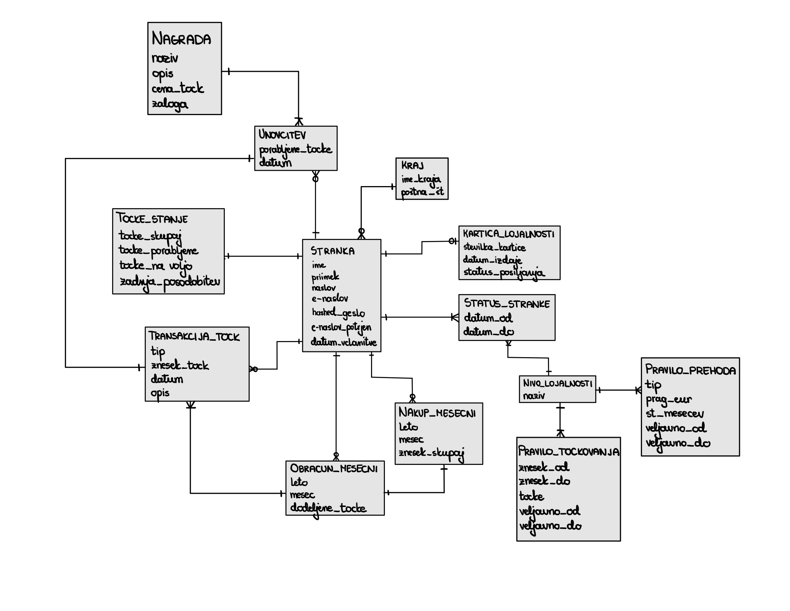

# Podatkovni model

Podatkovni model je ključni del načrtovanja sistema, saj določa strukturo in organizacijo podatkov, ki jih bo sistem uporabljal. V našem primeru bomo definirali podatkovni model za sistem zvestobe, ki vključuje entitete, njihove atribute in odnose med njimi.

## Diagram entitet in odnosov (ER diagram)

| Oznaka | Tabela             | Opis                                                           |
| ------ | ------------------ | -------------------------------------------------------------- |
| T1     | Stranka            | Entiteta, ki predstavlja člana programa zvestobe.              |
| T2     | Kraj               | Šifrant krajev                                                 |
| T3     | Kartica_lojalnosti | Kartica, ki je vezana na stranko in omogoča zbiranje točk.     |
| T4     | Status_stranke     | Beleži časovne intervale statusa (nivoja) stranke.             |
| T5     | Nivo_lojalnosti    | Šifrant nivojev zvestobe (npr. bronast, srebrn, zlat).         |
| T6     | Tocke_stranke      | Agregiran pregled točk stranke.                                |
| T7     | Transakcija_tock   | Posamezna transakcija dodelitve ali porabe točk.               |
| T8     | Nakup_mesecni      | Mesečni povzetek nakupov stranke, osnova za obračun točk.      |
| T9     | Obracun_mesecni    | Mesečni obračun dodeljenih točk na podlagi nakupov.            |
| T10    | Pravilo_tockovanja | Definira, koliko točk stranka prejme glede na vrednost nakupa. |
| T11    | Pravilo_prehoda    | Pogoji za prehod med nivoji zvestobe.                          |
| T12    | Nagrada            | Katalog nagrad, ki jih stranke lahko unovčijo za točke.        |
| T13    | Unovcitev          | Beleži unovčitev nagrade s strani stranke.                     |

