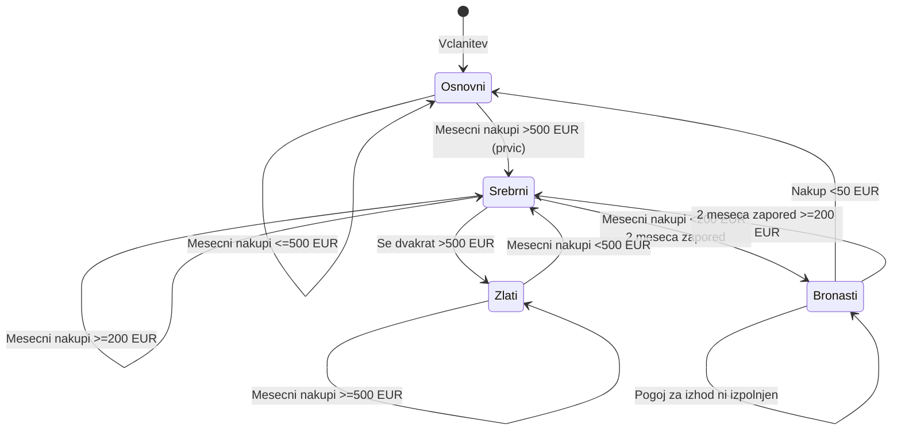
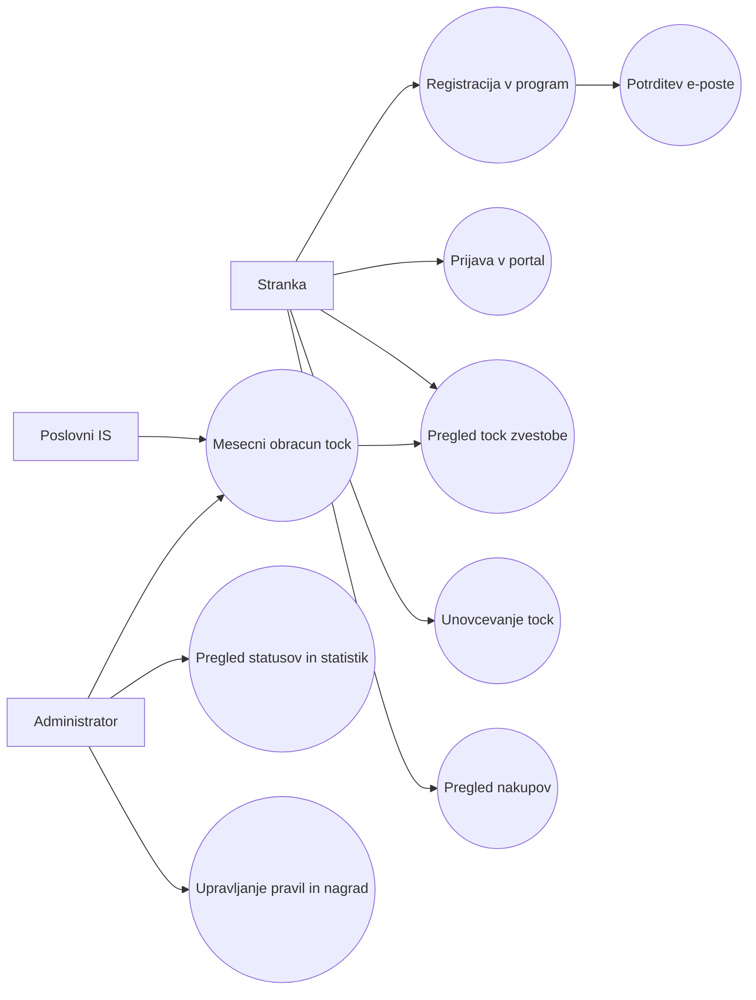

# Specifikacija zahtev

## Informacijski sistem za program lojalnosti Maestro

## Dokumentni podatki

| Polje                  | Vrednost                 |
| ---------------------- | ------------------------ |
| Oznaka dokumenta       | N1-LLM                   |
| Verzija                | 1.1                      |
| Status                 | Delovni osnutek          |
| Datum izdaje           | 2026-03-18               |
| Datum zadnje spremembe | 2026-03-18               |
| Jezik                  | Slovenščina              |
| Vir zahtev             | 01-Program-lojalnosti.md |
| Avtor                  | Martin Hovnik            |

## Zgodovina verzij

| Verzija | Datum      | Opis spremembe                                                                     |
| ------- | ---------- | ---------------------------------------------------------------------------------- |
| 1.0     | 2026-03-18 | Pripravljena začetna strukturirana specifikacija zahtev.                           |
| 1.1     | 2026-03-18 | Dodani naslovnica, dokumentni metapodatki, status in formalna struktura dokumenta. |

## Namen dokumenta

Dokument opredeljuje funkcionalne in nefunkcionalne zahteve, omejitve, vmesnike ter terminologijo za rešitev, ki podpira program lojalnosti trgovske verige Maestro.

## Obseg dokumenta

Dokument zajema zahteve, ki izhajajo iz izhodiščnega opisa problema in nalog v dokumentu 01-Program-lojalnosti.md.

---

# 1. Kratek opis sistema

Sistem podpira program lojalnosti trgovske verige Maestro. Namen sistema je povečati ponovne nakupe in dolgoročno zvestobo strank z dodeljevanjem točk ter upravljanjem statusov lojalnosti (osnovni, bronasti, srebrni, zlati).  
Strankam omogoča registracijo, pregled in koriščenje točk ter vpogled v nakupe, podjetju pa centralizirano upravljanje pravil, nagrad, statistik in statusov.

---

# 2. Funkcionalne zahteve

## 1. Upravljanje članstva in računov

- Sistem mora omogočiti vključitev stranke v program lojalnosti.
- Sistem mora omogočiti spletno registracijo z vnosom osebnih podatkov.
- Sistem mora zagotoviti varno preverjanje e-naslova ob registraciji (zahteva: preprečiti registracijo z ne-lastniškim e-naslovom).
- Ob registraciji mora sistem ustvariti uporabniški račun za prijavo v portal.
- Ob uspešni vključitvi mora sistem podpreti izdajo kartice lojalnosti in pripravo pošiljanja po navadni pošti.
- Ob včlanitvi mora stranka dobiti začetni status **osnovni**.

## 2. Nivoji lojalnosti

- Sistem mora podpirati nivoje: **osnovni, bronasti, srebrni, zlati**.
- Sistem mora omogočati možnost kasnejše spremembe delitve na nivoje (konfigurabilnost nivojev).

## 3. Mesečni izračun točk zvestobe

- Sistem mora 1x mesečno izračunati točke za pretekli mesec.
- Sistem mora za izračun uporabiti zneske nakupov iz poslovnega informacijskega sistema trgovske verige.
- Sistem mora dodeliti točke glede na zneskovni razred nakupov in status stranke.
- Sistem mora omogočiti kasnejše spreminjanje pravil/vrednosti točkovnika.

### 3.1 Točkovnik

| Znesek nakupov v mesecu | Osnovni | Bronasti | Srebrni | Zlati |
| ----------------------- | ------: | -------: | ------: | ----: |
| do 200 EUR              |       5 |        0 |     7.5 |    10 |
| med 200 EUR in 1000 EUR |      10 |        5 |      15 |    20 |
| nad 1000 EUR            |      20 |       10 |      30 |    40 |

**Predpostavka A1:** zaradi mej v opisu se razredi interpretirajo kot:

- `znesek <= 200`,
- `200 < znesek <= 1000`,
- `znesek > 1000`.

## 4. Pravila prehajanja med statusi

- Ob včlanitvi: status je **osnovni**.
- Ko stranka prvič preseže 499 EUR mesečnih nakupov, preide v **srebrni** status.
- Če nato še dvakrat preseže ta prag (>500), preide v **zlati** status.
- Za ohranjanje **srebrnega** statusa mora imeti vsaj 200 EUR mesečnih nakupov.
- Za ohranjanje **zlatega** statusa mora imeti vsaj 500 EUR mesečnih nakupov.
- Če ne izpolni pogoja za **zlati**, se status zniža na **srebrni**.
- Če ne izpolni pogoja za **srebrni** dva zaporedna meseca, preide v **bronasti** status.
- V **bronastem** statusu ostane, dokler:
  - dva zaporedna meseca ne opravi vsaj 200 EUR nakupov, **ali**
  - če opravi nakup pod 50 EUR, preide nazaj v **osnovni** status.
- Pri mesečni obdelavi mora sistem **najprej posodobiti status** in **šele nato** dodeliti točke.

**Predpostavka A2:** izraza `>499` in `>500` se obravnavata kot prag preseganja 500 EUR.

## 5. Portal za člane

Portal mora članom omogočati:

- pregled zbranih točk zvestobe,
- koriščenje (unovčevanje) točk,
- pregled nakupnega programa,
- pregled zneskov nakupov.

## 6. Administracija

Administratorski del mora omogočati:

- pregled statusov strank za poljubno obdobje,
- pregled statistike nakupov,
- poljubne poizvedbe po podatkovni bazi,
- upravljanje programa nagrad, ki je na voljo za točke,
# 3. Nefunkcionalne zahteve

## 1. Zmogljivost in kapaciteta

- Sistem mora podpirati vsaj ~500.000 članov (vsaj 70 % strank).
- Arhitektura mora omogočati bistveno večje število uporabnikov (širitev izven Slovenije).
- Mesečni obračun točk mora biti izvedljiv nad celotno bazo članov.
## 2. Varnost

- Registracija mora vključevati varen mehanizem potrditve lastništva e-poštnega naslova.
- Uporabniški računi morajo omogočati identifikacijo uporabnikov pri prijavi v portal.

- Pravila točkovanja in statusnih prehodov morajo biti nastavljiva brez spremembe koncepta sistema.
- Sistem mora podpirati morebitno spremembo delitve statusnih nivojev.

## 4. Uporabniška izkušnja

- Uporabniški vmesnik mora biti intuitiven.

## 5. Lokalizacija
- Celotna rešitev mora podpirati dva jezika: **slovenščino** in **angleščino**.

**Predpostavka A3:** podpora jezikom velja za članski in administratorski del portala.

---

# 4. Omejitve

- Podatkovna baza mora biti **Oracle** (obstoječe licence v podjetju).
- Izračun točk je periodičen in vezan na mesečni cikel (1x mesečno za pretekli mesec).
- Sistem je odvisen od podatkov o nakupih iz obstoječega poslovnega IS.
- Kartica lojalnosti se pošilja po navadni pošti (operativna omejitev procesa).
- Pravila programa so v grobem statična; pričakovane so spremembe vrednosti, ne pa popolna sprememba logike.
- Eksplicitne pravne zahteve (npr. skladnost s predpisi varstva osebnih podatkov) v izvoru niso navedene.

---

# 5. Vmesniki

## 1. Uporabniški vmesnik (članski portal)

- Spletni vmesnik za registracijo, prijavo, pregled točk, unovčevanje točk in pregled nakupov.

## 2. Administratorski vmesnik

- Spletni vmesnik za preglede statusov, statistike, upravljanje nagrad in pravil ter poizvedbe.

## 3. Integracijski vmesnik do poslovnega IS

- Prenos/uvoz mesečnih zneskov nakupov za obračun točk in statusov.

## 4. Podatkovni vmesnik do Oracle DB

- Branje/pisanje članov, statusov, točk, pravil, nagrad in analitičnih podatkov.

## 5. Vmesnik za potrjevanje e-pošte

- **Predpostavka A4:** potreben je integracijski mehanizem za pošiljanje/verifikacijo e-pošte ob registraciji.

## 6. Podpora procesu pošiljanja kartic

- **Predpostavka A5:** sistem mora zagotoviti podatke/izvoz za proces fizičnega pošiljanja kartic po pošti.

---

# 6. Diagrami sistema

## 6.1 Diagram prehajanja stanj

## 6.2 Diagram primerov uporabe

---

# 7. Slovar izrazov

- **Program lojalnosti**: sistem pravil in ugodnosti za nagrajevanje nakupne aktivnosti strank.
- **Član programa**: stranka, ki je vključena v program in ima kartico/račun.
- **Status lojalnosti**: nivo člana (osnovni, bronasti, srebrni, zlati), ki vpliva na točkovanje.
- **Točke zvestobe**: enote nagrajevanja, dodeljene na podlagi mesečnih nakupov in statusa.
- **Mesečni obračun**: periodični izračun točk za pretekli mesec.
- **Točkovnik**: pravila za pretvorbo zneska nakupov + statusa v točke.
- **Prehod statusa**: sprememba statusa člana glede na izpolnjevanje pragov nakupov.
- **Poslovni IS**: obstoječi informacijski sistem trgovske verige, vir podatkov o nakupih.
- **Portal**: spletna aplikacija za člane in administratorje.
- **Unovčevanje točk**: koriščenje zbranih točk za nagrade/ugodnosti.
- **Nakupni program**: vsebine, povezane s ponudbo za člane (izraz iz izvornega besedila).
- **Program nagrad**: nabor nagrad/ugodnosti, ki so na voljo za točke.
- **Konfigurabilnost pravil**: možnost spreminjanja vrednosti pravil brez večjih sprememb sistema.
